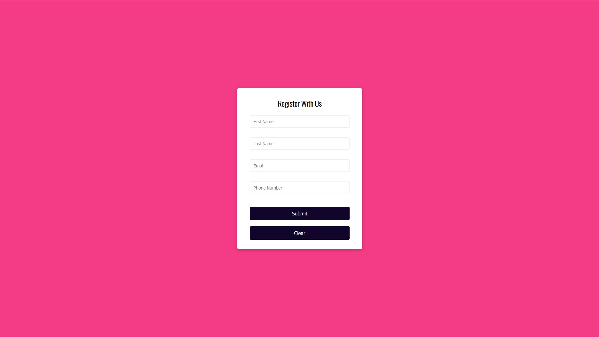

# Description

A simple form validator.

If the user does not enter the required information, they recieve an error message.

HTML | CSS | Javascript | Sweet Alert 2

# Screenshot

# Link

(https://eriksvetlik.github.io/formvalidation/)
